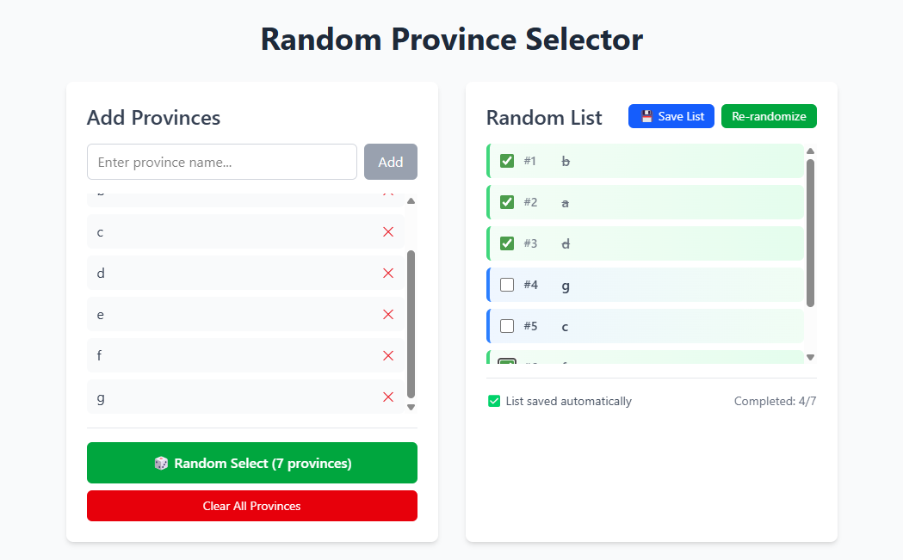

# Random Province Selector

A React-based web application that allows users to create and manage lists of provinces, then randomly select them in a shuffled order. Perfect for organizing visits, planning trips, or any scenario where you need to randomize a list of locations.



## Features

- **Add Provinces**: Easily add provinces to your list using the input field
- **Remove Provinces**: Remove unwanted provinces with a simple click
- **Random Selection**: Generate a randomized list of all your provinces
- **Progress Tracking**: Mark provinces as completed and track your progress
- **Save Lists**: Save your randomized lists for future reference
- **Persistent Storage**: All data is automatically saved to localStorage
- **Responsive Design**: Works seamlessly on desktop and mobile devices

## Technology Stack

- **React 19** - Modern React with the latest features
- **TypeScript** - Type-safe development
- **Tailwind CSS 4** - Utility-first CSS framework for styling
- **Vite** - Fast build tool and development server
- **ESLint** - Code linting and quality assurance

## Getting Started

### Prerequisites

- Node.js (version 18 or higher)
- npm or yarn package manager

### Installation

1. Clone the repository:

```bash
git clone <repository-url>
cd random-province-selector
```

2. Install dependencies:

```bash
npm install
```

3. Start the development server:

```bash
npm run dev
```

4. Open your browser and navigate to `http://localhost:5173`

## Available Scripts

- `npm run dev` - Start development server
- `npm run build` - Build for production
- `npm run preview` - Preview production build
- `npm run lint` - Run ESLint

## How to Use

1. **Adding Provinces**:

   - Enter a province name in the input field
   - Click "Add" or press Enter to add it to your list

2. **Managing Your List**:

   - Remove provinces by clicking the red "×" button next to each province
   - Clear all provinces using the "Clear All Provinces" button

3. **Random Selection**:

   - Click "Random Select" to generate a randomized list
   - The app will shuffle all your provinces and display them in random order

4. **Tracking Progress**:

   - Check off provinces in the randomized list as you complete them
   - View your completion progress (e.g., "Completed: 4/7")

5. **Saving Lists**:
   - Click "Save List" to save your current randomized list
   - Use "Re-randomize" to generate a new random order
   - Access saved lists from the interface

## Features in Detail

### Local Storage

All your data is automatically saved to your browser's local storage, so you won't lose your provinces or progress when you close the browser.

### Progress Tracking

The app tracks which provinces you've completed in your randomized list, showing both visual indicators and a completion counter.

### List Management

Save multiple randomized lists and switch between them as needed. Each saved list maintains its own completion state.

## Project Structure

```
src/
├── App.tsx          # Main application component
├── main.tsx         # Application entry point
├── index.css        # Global styles and Tailwind imports
└── assets/          # Static assets
```

## Contributing

1. Fork the repository
2. Create a feature branch (`git checkout -b feature/amazing-feature`)
3. Commit your changes (`git commit -m 'Add some amazing feature'`)
4. Push to the branch (`git push origin feature/amazing-feature`)
5. Open a Pull Request

## License

This project is open source and available under the [MIT License](LICENSE).

## Development Notes

- The app uses React 19's latest features for optimal performance
- TypeScript ensures type safety throughout the application
- Tailwind CSS 4 provides modern styling capabilities
- All state management is handled with React's built-in hooks
- Local storage integration ensures data persistence

## Browser Support

This application works on all modern browsers that support ES2020+ features:

- Chrome 80+
- Firefox 80+
- Safari 14+
- Edge 80+

---

Built with ❤️ using React and TypeScript
